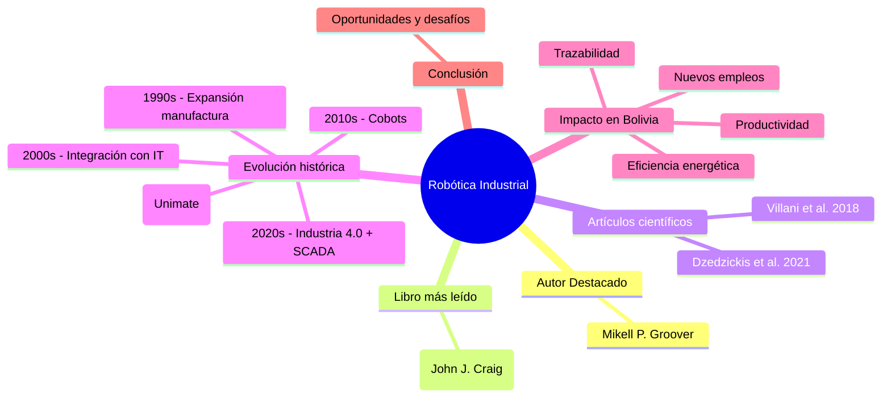

# Robótica Industrial — Evaluación Final

Bienvenido al proyecto de evaluación final sobre **Robótica Industrial**.  
Aquí encontrarás el desarrollo del tema dividido en secciones:

- [[1 Autor destacado|Autor destacado]]
- [[2 Libro de referencia|Libro más leído]]
- [[3 Artículos científicos|Artículos científicos relevantes]]
- [[4 Evolución histórica|Evolución histórica]]
- [[5 Impacto SCADA en Bolivia|Impacto de SCADA en Bolivia]]
- [[6 Conclusion|Conclusión]]
- [[Referencias|Bibliografía]]

---

## 🗺️ Mapa mental (Mermaid)
